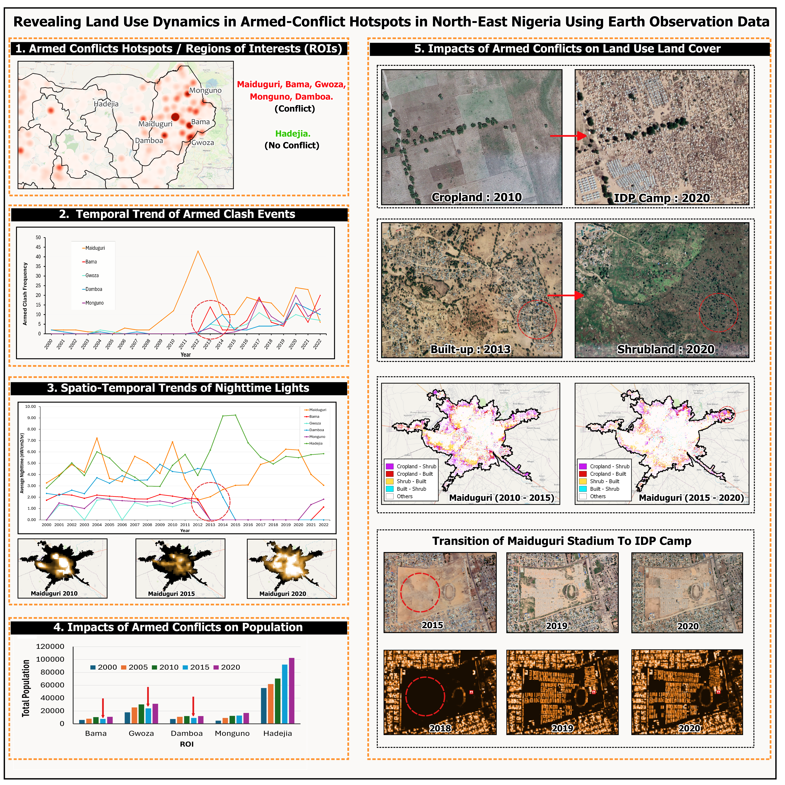

The Python notebook will be uploaded soon. Please check back later.

# Paper Title
Revealing Land Use Dynamics in Armed-Conflict Hotspots in North-East Nigeria Using Earth Observation Data


# Graphical Summary



# How to Run
All dependencies and their versions are listed in `land_conflict.yml` file.

## 1. Create the Conda environment

Open **Anaconda Prompt** and navigate to the folder containing `land_conflict.yml`:

```bash
cd path\to\your\folder
```

Then create the environment (the name `land-conflict` is already defined inside the `.yml`):

```bash
 conda env create -f land_conflict.yml
```

## 2. Activate the environment

Once installation completes successfully, activate it:

```bash
conda activate land-conflict
```


# How to Cite
If you used the code and/or data, kindly cite this paper:

APA STYLE: Lateef, L. O., Tella A.,  Miano J. R., & Aina Y. A. (2025). Revealing Land Use Dynamics in Armed-Conflict Hotspots in North-East Nigeria Using Earth Observation Data. Land Use Policy, 157, 107673. https://doi.org/10.1016/j.landusepol.2025.107673


# Credits
This project includes code from:

-  Ujaval Ghandi: https://gee-community-catalog.org/tutorials/examples/glc_fcs30d_lulc/


# Copyright
&copy; 2025. All rights reserved.