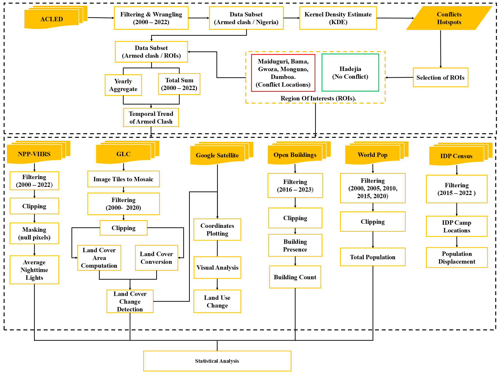

The Python notebook will be uploaded soon. Please check back later.

# Paper Title
Revealing Land Use Dynamics in Armed-Conflict Hotspots in North-East Nigeria Using Earth Observation Data

# Paper Citation
APA STYLE: Lateef, L. O., Tella A.,  Miano J. R., & Aina Y. A. (2025). Revealing Land Use Dynamics in Armed-Conflict Hotspots in North-East Nigeria Using Earth Observation Data. Land Use Policy, 157, 107673. https://doi.org/10.1016/j.landusepol.2025.107673

# Graphical Abstract

# Methodological Framework
